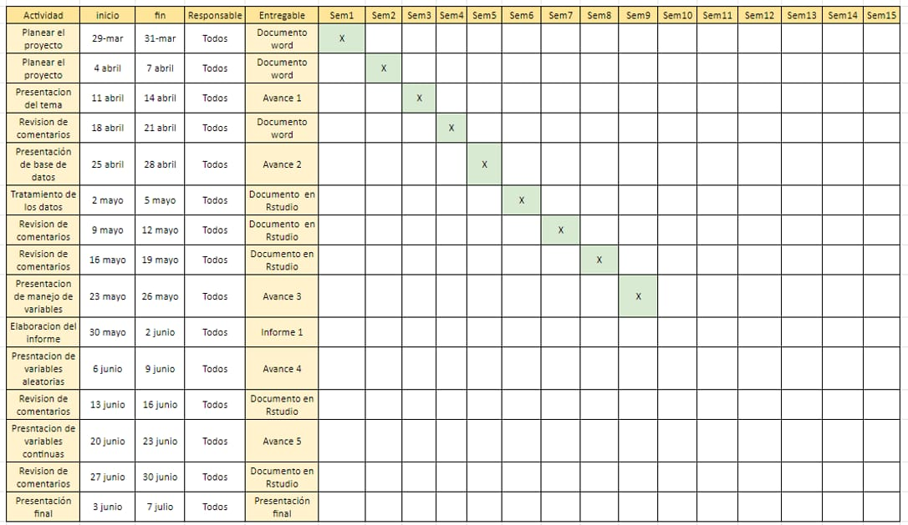

# Introducción

## Relevancia

La relevancia de nuestro proyecto radica que en la actualidad los servicios de Airbnb, representan una considerable oferta de alojamientos alrededor del mundo. Esta plataforma digital representa una gran acogida por muchos usuarios que desean alquilar un espacio a viajeros que buscan alojamiento, esto por la flexibilidad de precios en comparación con los hoteles.Es por ello que es importante realizar un análisis de en determinadas ciudades para conocer cómo funcionan los servicios de alojamiento en la actualidad.

## Objetivos

-   Analizar las ciudades con mejor ranking de experiencia de Airbnb en Europa del 2023.

-   Describir las características de los alojamientos más caros y más económicos en ciudades de Europa del 2023.

-   Analizar la atracción de un Airbnb y su relación con su ubicación en ciudades de Europa del 2023.

## Planificación

En esta sección el equipo se presenta la planificación de todas la entregas hasta la semana 16 

# Datos

## Proceso de recolección de datos

Para el proceso de recolección se realiza una búsqueda de base de datos de la siguiente página web <https://www.kaggle.com/datasets/dipeshkhemani/airbnb-cleaned-europe-dataset?group=bookmarked>. La elegida, es una fuente secundaria que tiene un total de 41714 observaciones y un total de 19 variables.

-   Población

    La población del estudio son todos airbnb's de nueve ciudades principales en Europa en el 2023.

-   Unidad muestra

    La unidad muestra es cada airbnb (alojamiento) que se encuentra en funcionamiento en esas nueve ciudades en Europa. \## Muestreo El método de muestreo utilizado fue muestreo aleatorio simple.

-   Tamaño de la muestra

    El tamaño de la muestra son 41714 alojamientos.

## Variables

| N°  |          Variable           |         Tipo         | Restricciones                                                                                                     |
|:-----------:|:-----------:|:-----------:|---------------------------------|
|  1  |            City             | (Categórica nominal) | Debe ser una de las nueve ciudades (Amsterdam, Roma, Lisboa , Viena, Atenas, París, Barcelona, Berlín y Budapest) |
|  2  |     Cuándo lo reservan      | (Categórica nominal) | Debe ser weekday o weekend.                                                                                       |
|  3  |          Room Type          | (Categórica nominal) | Debe ser una de los dos tipos de alojamiento "Entire home/apartamento" o "Cuarto privado"                         |
|  4  |         Shared Room         | (Categórica nominal) | Debe ser "Sí" o "No"                                                                                              |
|  5  |        Private Room         | (Categórica nominal) | Debe ser "Sí" o "No"                                                                                              |
|  6  |          Superhost          | (Categórica nominal) | Debe ser "Sí" o "No"                                                                                              |
|  7  |       Multiple Rooms        | (Categórica nominal) | Debe ser "Sí" o "No"                                                                                              |
|  8  |     Cleanliness Rating      | (Categórica ordinal) | Debe ser un número entero no negativo entre 0 y 10.                                                               |
|  9  |     Guest Satisfaction      | (Categórica ordinal) | Debe ser un número entero no negativo entre 0 y 100.                                                              |
| 10  |     Business (ofertas)      | (Categórica nominal) | Debe ser "Sí" o "No"                                                                                              |
| 11  |       Person Capacity       | (Numérica discreta)  | Debe ser un número entero no negativo.                                                                            |
| 12  |            Price            | (Numérica continua)  | Debe ser un número decimal no negativo en dólares.                                                                |
| 13  |          Bedrooms           | (Numérica discreta)  | Debe ser un número entero no negativo.                                                                            |
| 14  |      City Center (km)       | (Numérica continua)  | Debe ser un número decimal no negativo en kilómetros.                                                             |
| 15  |     Metro Distance (km)     | (Numérica continua)  | Debe ser un número decimal no negativo en kilómetros.                                                             |
| 16  | Normalised attraction Index | (Numérica continua)  | Debe ser un número decimal no negativo.                                                                           |
| 17  | Normalised restaurant index | (Numérica continua)  | Debe ser un número decimal no negativo.                                                                           |

## Limpieza de datos

### Lectura de base de datos

```{r}
library(readr)
library(dplyr)
library(ggplot2)
D <- read_csv("Aemf1.csv") #EL ARCHIVO Aemf1 y datos.AIRBNB es lo mismo. 
coef_var <- function(x, na.rm = FALSE) {sd(x, na.rm=na.rm) / mean(x, na.rm=na.rm)}
#coef_var()

roundF <- function(x){return(round(x,digits = 2))}

```

```{r}
# Número de Observaciones y Variables
nrow(D)
ncol(D)
```

-   Eliminamos la columna 18 y 16, ya que de esas variables usamos sólo sus valores normalizados.

```{r}
View(D) 

D$`Attraction Index` <- NULL
D$`Restraunt Index` <- NULL

```

-   Re asignación de nombres :

```{r}
names(D)
```

```{r}
D %>% rename( Tipo = `Room Type` , Capacidad = `Person Capacity`, Oferta = Business, Habitaciones = Bedrooms, Ind.Atraccion = `Normalised Attraction Index`, Precio = Price, Share_Room = `Shared Room`, Limpieza = `Cleanliness Rating`, Ind.Restaurantes = `Normalised Restraunt Index`, Satisfaccion = `Guest Satisfaction`, Ciudad = City, Private_Room = `Private Room`, Distance_Center = `City Center (km)`, Distance_Metro = `Metro Distance (km)`) -> D2

View(D2)
```

```{r}
names(D2)
```

-   Búsqueda de NA y comprobación de casos completos

```{r}
Total_de_NAs <- sum(is.na(D))
print(paste("El total de NAs es :", Total_de_NAs)) 

Observaciones_completas <- sum(complete.cases(D2))
print(paste("Observaciones completas es : ",Observaciones_completas ))
Observaciones_incompletas <- sum(!complete.cases(D2))
print(paste("Observaciones incompletas es : ", Observaciones_incompletas))
```

-   Para la limpieza de datos se tiene encuenta lo siguiente:

#### Verificar Variables booleanas

```{r}
# El primer paso para la limpieza de datos es hacer un resumen de los datos que se tienen.
summary(D2)
```

-   **Multiple Rooms, Shared Room, Private Room y Oferta :** En primer lugar, se observa que Multiple rooms tiene como valor mínimo 0 y como valor máximo 1; esto mismo ocurre en el caso de la variable Oferta. Procedemos a analizar qué valores se encuentran dentro de estas dos variables.

```{r}
par(mfrow=c(1,2))

counts <- table(D2$`Multiple Rooms`)
barplot(counts, main = "Multiple Rooms", ylab = "Número de Observaciones", xlab = "Valores" , ylim = c(0,35000))

```

```{r}
counts <- table(D2$Oferta)
barplot(counts, main = "Oferta", ylab = "Número de Observaciones", xlab = "Valores" , ylim = c(0,30000), xlim = c(0,2) )
#Como se observa, ambas variables cuentan solamente con "0" y "1" como valores, por lo que se trata de variables booleanas. Se observa que, además de estas dos variables, se tiene que Share_Room, Private_Room y Superhost también son variables de tipo bool. Para facilitar las operaciones futuras, se procederá a cambiar los "0" y "False" a la cadena "No", y los "1" y "True" a la cadena "Sí".
```

```{r}
vec <- factor(D2$Oferta, labels = c('No','Sí'))
D2$Oferta <- vec
vec <- factor(D2$`Multiple Rooms`, labels = c('No','Sí'))
D2$`Multiple Rooms` <- vec
vec <- factor(D2$Share_Room, labels = c('No','Sí'))
D2$Share_Room <- vec
vec <- factor(D2$Private_Room, labels = c('No','Sí'))
D2$Private_Room <- vec
vec <- factor(D2$Superhost, labels = c('No','Sí'))
D2$Superhost <- vec
```

#### Verificar variables númericas enteras:

-   **Capacidad y Habitaciones :** Se verifica que Capacidad contenga solamente números enteros.El mismo análisis se realizará para la variable Habitaciones.

```{r}
par(mfrow=c(1,2))
counts <- table(D2$Capacidad)
barplot(counts, main = "Capacidad", ylab = "Número de Observaciones", xlab = "Valores" , ylim = c(0,20000))
counts <- table(D2$Habitaciones)
barplot(counts, main = "Habitaciones", ylab = "Número de Observaciones", xlab = "Valores" , ylim = c(0,30000))
```

Se observa que la variable habitaciones tiene casos con valor 0. A continuación se analizarán estos casos; para ello, se filtrarán las filas que tienen 0 habitaciones.

```{r}
filter(D2, Habitaciones==0)
```

Se observa que no hay ningún patrón o algo que indique por qué estos airbnb tienen 0 habitaciones. Como no se tiene evidencia para sustentar que un airbnb pueda tener 0 habitaciones, se procederá a colocar NA's en las filas donde se encuentran los airbnb con 0 habitaciones.

```{r}
D2$Habitaciones <- replace(D2$Habitaciones, D2$Habitaciones==0, NA)
```

A continuación, se verificará que los valores de Habitaciones se hayan reemplazado correctamente.

```{r}
counts <- table(D2$Habitaciones)
barplot(counts, main = "Habitaciones", ylab = "Número de Observaciones", xlab = "Valores" , ylim = c(0,30000))
```

Limpieza y Satisfacción : son puntuaciones dejadas por los usuarios de los airbnb's, son números enteros.

```{r}
counts <- table(D2$Limpieza)
barplot(counts, main = "Limpieza", ylab = "Número de Observaciones", xlab = "Valores" , ylim = c(0,20000))
```

```{r}
table(D2$Satisfaccion)
```

Se observa que la variable Limpieza tiene solamente números enteros en el rango 2-10 y la variable Satisfacción también, entre 20-100.

#### Verificar variables númericas no enteras

```{r}summary(D2)}


```

-   **Precio, City Center, Metro distance , Attraction y Restaurants Normalized :** se observa que el Indice de Atracción normalizado y el Índice de Restaurantes normalizado se encuentran dentro (0-100). También se tienen a las variables Precio, City Center y Metro Distance. Se observa que los valores máximos se alejan considerablemente de la media. Por este motivo, se procederá a analizar cada una de estas variables.

```{r}
plot(D2$Precio, xlab= "Airbnb's" , ylab = "Precio")
```

Se observa que hay muy pocos casos por encima de 10000 dólares, a continuación se filtrará las filas que tienen un precio mayor a 10000 USD.

```{r}
filter(D2, Precio>10000)
```

Después de revisar los datos actuales en Airbnb a través de su aplicación, se encontró que, actualmente, hay 405 alojamientos en Atenas, más de 1000 en París, 168 en Vienna que tienen precios por encima de los 10000 USD. Por este motivo, estos datos se continuarán considerando dentro del dataset.

A continuación se analiza la variable Distance_Center, que representa la distancia al centro de del airbnb.

```{r}
plot(D2$Distance_Center, xlab= "Airbnb's" , ylab = "Distance to City Center (km)")
```

Se observa que son pocos los airbnb's que tienen una distancia al centro por encima de 15 Km, se procederá a filtrar las filas según esta condición.

```{r}
filter(D2, Distance_Center>15)
```

A continuación se analizarán en qué ciudades se encuentran estos airbnb's.

```{r}
unique(filter(D2, Distance_Center>15)[,'Ciudad'])
```

Se observa que estos airbnb's se ubican en Berlin o Budapest. El área de estas ciudades es de 891.2 km^2^ y 525.2 km^2^, respectivamente. Debido a esto, es posible que existan airbnb's que se encuentren a 15 km o más de distancia del centro.

A continuación se analizará la variable Distance_Metro, que representa la distancia a la estación de metro más cercana al airbnb.

```{r}
plot(D2$Distance_Metro, xlab= "Airbnb's" , ylab = "Distance to Metro Station (km)")
```

Se filtrarán los airbnb's con distancia mayor a 8km, ya que se observa que no son muchos en la gráfica.

```{r}
filter(D2, Distance_Metro>8)
```

A continuación se analizarán en qué ciudades se encuentran estos airbnb's.

```{r}
unique(filter(D2, Distance_Metro>8)[,'Ciudad'])
```

Nuevamente, se observa que las ciudades son Berlín y Budapest, que son ciudades bastante grandes como se mencionó en el punto anterior. Por este motivo, se considerarán como datos válidos.

#### Verificando variables de tipo character

Por último se procederá a analizar las variables Ciudad, Día y Tipo; estas son catalogadas por R como variables de tipo char. Para el caso, de la variable Ciudad, deberían haber 9 valores distintos, que representen las 9 ciudades a las que pertenece la data.

```{r}
unique(D2$Ciudad)
unique(D2$Tipo)
unique(D2$Day)
counts <- table(D2$Ciudad)
barplot(counts, main = "Ciudad", ylab = "Número de Observaciones" , las=2, ylim = c(0,10000), cex.names = 0.9)
```

Una vez comprobado que solamente existen 9 ciudades en el Dataframe, se procede a revisar el Día y Tipo de airbnb.

```{r}
par(mfrow=c(1,2)) #QUE HACE mfrow ?
counts <- table(D2$Day)
barplot(counts, main = "Día", ylab = "Número de Observaciones", las = 2, ylim = c(0,25000), cex.axis = 0.8, cex.lab = 0.7, cex.names = 0.6)
counts <- table(D2$Tipo)
barplot(counts, main = "Tipo", ylab = "Número de Observaciones", las = 2, ylim = c(0,30000), cex.axis = 0.8, cex.names = 0.6, cex.lab = 0.7)
```

Se observa que tampoco existen anomalías en estas variables, por lo que podemos concluir que nuestra data se encuentra en condiciones de ser utilizada para los análisis posteriores.

# Análisis descriptivo

### 1. Análisis Univariado :

```{r}

##
## SATISFACCIÓN
##
table(D2$Satisfaccion)
```

```{r}
which.max(table(D2$Satisfaccion))
which.min(table(D2$Satisfaccion))
```

Se observa que, para en el caso de la variable satisfacción, la mayor parte de personas indicó que la limpieza podía tomar el máximo valor (100), mientras que el puntaje menos marcado fue de 54. En la tabla también se observa que, desde el valor de 88 hasta 100, más de 1000 personas marcaron cada uno de esos puntajes.

```{r}
##
## LIMPIEZA
##
table(D2$Limpieza)
```

```{r}
which.max(table(D2$Limpieza))
which.min(table(D2$Limpieza))
```

En el caso de la variable limpieza, se observa que los 3 valores más seleccionados son 8, 9 y 10; en ese orden. El valor menos seleccionado por los usuarios es el de 3.

```{r}
##
## ATRACCIÓN
##
mean_atraccion <- mean(D2$Ind.Atraccion)
median_atraccion <- median(D2$Ind.Atraccion)
par(mfrow=c(1,2)) #QUE HACE mfrow ?
boxplot(D2$Ind.Atraccion, main = "Atracción", xlab = "Índice de Atracción", ylab = "Frecuencia")
# Add mean as a red point
points(mean_atraccion, col = "red", pch = 16)
# Add median as a blue point
points(median_atraccion, col = "blue", pch = 16)
hist(D2$Ind.Atraccion, main = "Atracción", xlab = "Índice de Atracción", ylab = "Frecuencia")
# Add mean as a red dashed line
abline(v = mean_atraccion, col = "red", lwd = 2)
# Add median as a blue dashed line
abline(v = median_atraccion, col = "blue", lwd = 2)
```

```{r}
mean_atraccion
median_atraccion
IQR(D2$Ind.Atraccion)
quantile(D2$Ind.Atraccion) 
```

El índice de atracción se encuentra normalizado, por lo que los valores que puede tomar son del 1 al 100. En las gráficas se puede observar que la mayoría de valores se encuentran por debajo de 20, y que la media y la mediana son valores cercanos a 10. En los valores obtenidos se aprecia que más del 50% de los datos es menor a 10 y el 75% de los datos son menores a 15.47. Con esta información, se puede afirmar que la mayoría de valores son bajos para el índice de atracción.

```{r}
##CIUDADES
ggplot(D2, aes(x=Ciudad))+geom_bar()+labs(title="Ciudades con Airbnb", x="Ciudades", y="Frecuencia") +theme_minimal()
```

En esta gráfica de barras podemos observar que la ciudad en la cual hay más personas que reservan habitaciones es Roma.

```{r}
##Precio
mean_precio<- mean(D2$Precio)
median_precio <- median(D2$Precio)
par(mfrow=c(1,2))
boxplot(D2$Precio, main = "Precio de habitaciones en Airbnb", xlab = "Precio", ylab = "Frecuencia")
# Add mean as a red point
points(mean_precio, col = "red", pch = 16)
# Add median as a blue point
points(median_precio, col = "blue", pch = 16)
hist(D2$Precio, main = "Precio de habitaciones en Airbnb", xlab = "Precio", ylab = "Frecuencia")
# Add mean as a red dashed line
abline(v = mean_precio, col = "red", lwd = 2)
# Add median as a blue dashed line
abline(v = median_precio, col = "blue", lwd = 2)
```

```{r}
mean_precio
median_precio
IQR(D2$Precio)
quantile(D2$Precio) 
```

La gráfica se puede observar de la siguiente manera porque la variable precio puede tomar valores entre 34.78 y 18454.45. Donde vemos que la mayoría de loa valores del precio está por debajo de 230.8. También, la media y mediana son 260 y 203.

```{r}
##Día
ggplot(D2, aes(x=Day))+geom_bar()+labs(title="Días de Reservación", x="Días", y="Frecuencia") +theme_minimal()

```

```{r}
##Tipo

ggplot(data= D2, mapping=aes(x=Tipo))+ geom_bar()+ theme_grey()+ labs(title="Gráfica de tipos de habitaciones",x="Tipo",y="Frecuencias")


```

Los día de semana y los fines de semana tienen una similar cantidad de pedido.

```{r}
#CAPACIDAD

mean_capacidad <- mean(D2$Capacidad)
median_capacidad <- median(D2$Capacidad)
par(mfrow=c(1,2)) 
boxplot(D2$Capacidad, main = "Capacidad", xlab = "Capacidad", ylab = "Frecuencia")
# Add mean as a red point
points(mean_capacidad, col = "red", pch = 16)
# Add median as a blue point
points(median_capacidad, col = "blue", pch = 16)
hist(D2$Capacidad, main = "Capacidad", xlab = "Capacidad", ylab = "Frecuencia")
# Add mean as a red dashed line
abline(v = mean_capacidad, col = "red", lwd = 2)
# Add median as a blue dashed line
abline(v = median_capacidad, col = "blue", lwd = 2)
```

```{r}
mean_capacidad
median_capacidad
IQR(D2$Capacidad)
quantile(D2$Capacidad) 
```

```{r}
##SUPERHOST
plot(x = D2$Superhost, main = "Gráfica de Superhost",
     xlab = "Superhost", ylab = "Frecuencia")
```

```{r}
##MULTIPLE ROOM

ggplot(data= D2, mapping=aes(x=`Multiple Rooms`))+ geom_bar()+ theme_grey()+ labs(title="Gráfica de habitaciones múltiples",x="Tipo",y="Frecuencias")
```

```{r}
##OFERTA
ggplot(data= D2, mapping=aes(x=Oferta))+ geom_bar()+ theme_grey()+ labs(title="Gráfica de Oferta",x="Ofertas",y="Frecuencias")
```

```{r}
##Habitaciones 
mean_habitaciones <- mean(D2$Habitaciones,na.rm = TRUE)
median_habitaciones <- median(D2$Habitaciones,na.rm=TRUE)
par(mfrow=c(1,2)) 
boxplot(D2$Habitaciones, main = "Número de habitaciones", xlab = "Habitaciones", ylab = "Frecuencia")
# Add mean as a red point
points(mean_habitaciones, col = "red", pch = 16)
# Add median as a blue point
points(median_habitaciones, col = "blue", pch = 16)
hist(D2$Habitaciones, main = "Número de habitaciones", xlab = "Habitaciones", ylab = "Frecuencia")
# Add mean as a red dashed line
abline(v = mean_habitaciones, col = "red", lwd = 2)
# Add median as a blue dashed line
abline(v = median_habitaciones, col = "blue", lwd = 2)
```

```{r}
mean_habitaciones
median_habitaciones
IQR(D2$Habitaciones, na.rm=TRUE)
quantile(D2$Habitaciones,na.rm=TRUE) 
```

Se observa que la mayor parte de airbnb's cuenta con una sola habitación.

```{r}
##DISTANCE CENTER
mean_distC <- mean(D2$Distance_Center)
median_distC <- median(D2$Distance_Center)
par(mfrow=c(1,2)) 
boxplot(D2$Distance_Center, main = "Distance center", xlab = "Distance Center", ylab = "Frecuencia")
# Add mean as a red point
points(mean_distC, col = "red", pch = 16)
# Add median as a blue point
points(median_distC, col = "blue", pch = 16)
hist(D2$Distance_Center, main = "Distance Center", xlab = "Distance Center", ylab = "Frecuencia")
# Add mean as a red dashed line
abline(v = mean_distC, col = "red", lwd = 2)
# Add median as a blue dashed line
abline(v = median_distC, col = "blue", lwd = 2)
```

```{r}
mean_distC
median_distC
IQR(D2$Distance_Center)
quantile(D2$Distance_Center) 
```

```{r}
##DISTANCE METRO

mean_distM <- mean(D2$Distance_Metro)
median_distM <- median(D2$Distance_Metro)
par(mfrow=c(1,2)) 
boxplot(D2$Distance_Metro, main = "Distance Metro", xlab = "Distance Metro", ylab = "Frecuencia")
# Add mean as a red point
points(mean_distM, col = "red", pch = 16)
# Add median as a blue point
points(median_distM, col = "blue", pch = 16)
hist(D2$Distance_Metro, main = "Distance Metro", xlab = "Distance Metro", ylab = "Frecuencia")
# Add mean as a red dashed line
abline(v = mean_distM, col = "red", lwd = 2)
# Add median as a blue dashed line
abline(v = median_distM, col = "blue", lwd = 2)
```

```{r}
mean_distM
median_distM
IQR(D2$Distance_Metro)
quantile(D2$Distance_Metro) 
```

```{r}
##Índice de restaurantes
mean_Ind.Restaurant <- mean(D2$Ind.Restaurantes)
median_Ind.Restaurant <- median(D2$Ind.Restaurantes)
par(mfrow=c(1,2)) 
boxplot(D2$Ind.Restaurantes, main = "Índice de Restaurantes", xlab = "Índice de Restaurantes", ylab = "Frecuencia")
# Add mean as a red point
points(mean_Ind.Restaurant, col = "red", pch = 16)
# Add median as a blue point
points(median_Ind.Restaurant, col = "blue", pch = 16)
hist(D2$Ind.Restaurantes, main = "Índice de Restaurantes", xlab = "Índice de Restaurantes", ylab = "Frecuencia")
# Add mean as a red dashed line
abline(v = mean_Ind.Restaurant, col = "red", lwd = 2)
# Add median as a blue dashed line
abline(v = median_Ind.Restaurant, col = "blue", lwd = 2)
```

```{r}
mean_Ind.Restaurant
median_Ind.Restaurant
IQR(D2$Ind.Restaurantes)
quantile(D2$Ind.Restaurantes) 
```

### 2. Análisis Bivariado :

```{r}
##Ciudad VS Tipo

D3 <- D2

D3$Ciudad[D3$Ciudad== "Amsterdam"] <- "AMS"
D3$Ciudad[D3$Ciudad== "Athens"] <- "ATH"
D3$Ciudad[D3$Ciudad== "Barcelona"] <- "BAR"
D3$Ciudad[D3$Ciudad== "Berlin"] <- "BER"
D3$Ciudad[D3$Ciudad== "Budapest"] <- "BUD"
D3$Ciudad[D3$Ciudad== "Lisbon"] <- "LISB"
D3$Ciudad[D3$Ciudad== "Paris"] <- "PAR"
D3$Ciudad[D3$Ciudad== "Rome"] <- "ROM"
D3$Ciudad[D3$Ciudad== "Vienna"] <- "VIEN"

tipo_habitacionCiudad <- (table(D3$Tipo,D3$Ciudad))

mosaicplot(tipo_habitacionCiudad)
```

ANÁLISIS -\> DEMANDA MAYOR POR LAS CASAS COMPLETAS/APART EN LAS CIUDADESS ROMA, PARIS Y ATHENAS

```{r}
#CAPACIDAD VS SHARE ROOM

tipo_CapacidadSHAREROOM <- (table(D2$Capacidad,D2$Share_Room))

mosaicplot(tipo_CapacidadSHAREROOM)
```

ANÁLISIS -\> PREFERENCIA POR NO COMPARTIR HABITACIÓN

```{r}
# Ciudad VS Habitaciones 
ggplot(D2) +
  aes(x = Ciudad, y = Habitaciones) +
  geom_boxplot(fill = "#ACC527") +
  theme_minimal()

```

ANÁLISIS -\> LA PREFERENCIA POR LA CANTIDAD DE HABITACIONES A RESERVAR ES MENOR A 2

### 3. Objetivos

### Objetivo 1 :Analizar las ciudades con mejor ranking de experiencia de Airbnb en Europa del 2023.

1.  Promedio de satisfacción, promedio de precio, número de superhost, número de airbnbs, promedio de índice de atracción por ciudad.

```{r}
D2 %>% 
  group_by(Ciudad) %>% 
  summarise(`Precio Promedio` = mean(Precio),
            `Número de Airbnb's` = n(),
            `Satisfaccion Promedio` = mean(Satisfaccion), 
            `Superhosts %` = prop.table(table(Superhost))["Sí"],
            `Índice de Atracción Promedio` = mean(Ind.Atraccion)) -> D_Ciudades
arrange(D_Ciudades)

```

# HACER COMENTARIOS DE LA TABLA AQUI

```{r}
D2 %>% filter(Ciudad =='Amsterdam') -> DAMS
D2 %>% filter(Ciudad =='Barcelona') -> DBAR
D2 %>% filter(Ciudad =='Athens') -> DATH
D2 %>% filter(Ciudad =='Berlin') -> DBER
D2 %>% filter(Ciudad =='Budapest') -> DBUD
D2 %>% filter(Ciudad =='Lisbon') -> DLIS
D2 %>% filter(Ciudad =='Paris') -> DPAR
D2 %>% filter(Ciudad =='Rome') -> DROM
D2 %>% filter(Ciudad =='Vienna') -> DVIE

#par(mfrow=c(3,3), fin=c(5,4))

```

```{r}

hist(DAMS$Precio, xlab = 'Precio', ylab = 'Frecuencia', main = 'Precios en Amsterdam')
# Add mean as a red dashed line
abline(v = mean(DAMS$Precio), col = "red", lwd = 2)
# Add median as a blue dashed line
abline(v = median(DAMS$Precio), col = "blue", lwd = 2)

hist(DBAR$Precio, main = "Precios en Barcelona", xlab = "Precio", ylab = "Frecuencia")
# Add mean as a red dashed line
abline(v = mean(DBAR$Precio), col = "red", lwd = 2)
# Add median as a blue dashed line
abline(v = median(DBAR$Precio), col = "blue", lwd = 2)

hist(DATH$Precio, main = "Precios en Atenas", xlab = "Precio", ylab = "Frecuencia")
# Add mean as a red dashed line
abline(v = mean(DATH$Precio), col = "red", lwd = 2)
# Add median as a blue dashed line
abline(v = median(DATH$Precio), col = "blue", lwd = 2)

hist(DBER$Precio, main = "Precios en Berlin", xlab = "Precio", ylab = "Frecuencia")
# Add mean as a red dashed line
abline(v = mean(DBER$Precio), col = "red", lwd = 2)
# Add median as a blue dashed line
abline(v = median(DBER$Precio), col = "blue", lwd = 2)

hist(DBUD$Precio, main = "Precios en Budapest", xlab = "Precio", ylab = "Frecuencia")
# Add mean as a red dashed line
abline(v = mean(DBUD$Precio), col = "red", lwd = 2)
# Add median as a blue dashed line
abline(v = median(DBUD$Precio), col = "blue", lwd = 2)

hist(DLIS$Precio, main = "Precios en Lisboa", xlab = "Precio", ylab = "Frecuencia")
# Add mean as a red dashed line
abline(v = mean(DLIS$Precio), col = "red", lwd = 2)
# Add median as a blue dashed line
abline(v = median(DLIS$Precio), col = "blue", lwd = 2)

hist(DPAR$Precio, main = "Precios en Paris", xlab = "Precio", ylab = "Frecuencia")
# Add mean as a red dashed line
abline(v = mean(DPAR$Precio), col = "red", lwd = 2)
# Add median as a blue dashed line
abline(v = median(DPAR$Precio), col = "blue", lwd = 2)

hist(DROM$Precio, main = "Precios en Roma", xlab = "Precio", ylab = "Frecuencia")
# Add mean as a red dashed line
abline(v = mean(DROM$Precio), col = "red", lwd = 2)
# Add median as a blue dashed line
abline(v = median(DROM$Precio), col = "blue", lwd = 2)

hist(DVIE$Precio, main = "Precios en Vienna", xlab = "Precio", ylab = "Frecuencia")
# Add mean as a red dashed line
abline(v = mean(DVIE$Precio), col = "red", lwd = 2)
# Add median as a blue dashed line
abline(v = median(DVIE$Precio), col = "blue", lwd = 2)
```

2.  Índice de satisfacción VS Precio

```{r}
plot(x = D2$Satisfaccion, y = D2$Precio, xlab = "Satisfacción" , ylab = "Precio", ylim= c(0,2500))
```

```{r}
cor(D2$Satisfaccion, D2$Precio)
```

Del gráfico se puede observar que la correlación entre ambas variables es muy baja. Después de hallar el valor de la correlación, se comprueba esta observación, ya que su valor es de 0.016.

3.  Gráfica de Atracción normalizada VS Precio

```{r}
plot(x = D2$Ind.Atraccion, y = D2$Precio, xlab = "Índice de Atracción" , ylab = "Precio", ylim= c(0,2500))
```

```{r}
cor(D2$Ind.Atraccion, D2$Precio)
```

Del gráfico se puede observar que la correlación entre ambas variables es baja. Después de hallar el valor de la correlación, se comprueba esta observación, ya que su valor es de 0.271.

4.  Gráfica de Ciudad VS Cuándo se reserva

```{r}
mosaicplot(table(D2$Ciudad, D2$Day), main = "Cuándo se reserva - Ciudad", xlab = "Ciudades", ylab = "Cuándo se Reserva", las = 0.7, )
```

La ciudad más concurrida es Roma, debido al número de reserva que se hace dentro de semanas y fienes de semanas. Además que presentan equilibrio de reservas ROMA

### Objetivo 2 : Describir las características de los alojamientos más caros y más económicos en ciudades de Europa del 2023.

1.  Conocer el total de las ciudades que pertenecen a la base de datos

2.  Conocer el precio promedio de los alojamientos en las 9 ciudades

3.  Conocer la mediana del precio de los alojamientos

4.  Identificar cuáles son las observaciones que se encuentran por debajo de la mediana : "ECO"

5.  Identificar cuáles son las observaciones que se encuentran por arriba de la mediana : "CARO"

6.  De la mitad mayor a la mediana, identificar la moda de Superhost y Room Type

7.  Conocer el precio más económico y sus características

8.  Identificar el tipo de cuarto de las habitaciones más económicas

9.  Conocer el precio más caro e identificar sus características

10. Identificar el tipo de cuarto de las habitaciones más caras

11. Conocer el precio más caro e identificar sus características

12. Analizar por ciudades las características del alojamiento más caro y económico, analizar la relación precio y ubicación, analizar la relación precio e indice de restaurantes y atracción.

### Desarrollo :

-   **Conocer el total de las ciudades que pertenecen a la base de datos**

```{r}

c <- table(D2$Ciudad)
sum(c)
barplot(c, main = "Ciudades en el Estudio", ylab = "Número de Observaciones" , las=2, ylim = c(0,10000), cex.names = 0.9, col=c("orange"))


```

*Análisis : La mayor cantidad de alojamientos de todo el estudio se encuentran en Roma.*

-   **El precio promedio en todas las ciudades de Europa: Se realiza un boxplot para cada ciudad.**

```{r}
ggplot(D2) +
  aes(x = Precio, y = Ciudad) +
  geom_boxplot(fill = "#FF8C00") +
  theme_minimal()
```

*Se puede observar que el precio de rentabilidad en base a todas la ciudades no supera los 2500 dólares en mayor proporción*

```{r}
s <-round(mean(D2$Precio),digits = 2)
s
```

*El precio de los alojamientos se encuentran alrededor de los 260.09 dólares.*

-   **Conocer la mediana del precio de los alojamientos**

    ```{r}
    mediana_precio <- median(D2$Precio)
    mediana_precio
    ```

*Se concluye que la mitad de los alojamientos de todas las ciudades son mayores a este valor, por lo tanto se les considera cómo la mitad con precios más caros. La parte inferior se consideran cómo económicos.*

*Al analizar estos 2 descriptores para la variable precio, se observa que la media es mayor a la mediana (sesgado a la derecha, quiere decir que el lado derecho tiene pocas observaciones , osea que los alojamiento con precios muy altos son pocos con respecto al total)*

-   **Identificar cuáles son las observaciones que se encuentran por arriba de la mediana : "CARO"**

*Filtramos la mitad superior a la mediana y tenemos un total de 20,855 airbnbs.*

```{r}
D2 %>% filter(Precio > mediana_precio) %>% arrange(desc(Precio)) -> CAROS
CAROS
nrow(CAROS) #Es el total de Airbnb con precios mayores a los 203.8193 (mediana)


```

*Del grupos de los Caros, Atenas es el que menos alojamientos tiene en el estudio (795). El de más apariciones es París (5,724). Se concluye que París es la ciudad con mayor cantidad de alojamiento con precios elevados.*

```{r}
c1 <- table(CAROS$Ciudad) #Del grupos de los Caros, Atenas es el que menos alojamientos tiene en el estudio (795). El de más apariciones es París (5,724)
c1
min(c1)
which.min(c1)

barplot(c1, main = "Ciudades con más alojamientos caros", ylab = "Número de Observaciones" , las=2, ylim = c(0,10000), cex.names = 0.9, col=c("green"))

```

*Analizamos los 100 alojamientos más caros :*

```{r}
#Analizamos el lado de  los 100 alojamientos más caros : 

CAROS[1:100, ] -> CAROS100 
CAROS100

#Qué ciudad aparece más aquí en alojamientos caros : 
ciudades_100 <- table(CAROS100$Ciudad)
ciudades_100 
barplot(ciudades_100, main = "Ciudades con más alojamientos con precios elevados", col= c("skyblue"),, las=2, cex.names = 0.9)

superhost100 <- table(CAROS100$Superhost)
barplot(superhost100, main = 'Superhost', col =c( "#CCFF99","#9999FF" ))
legend("topright",legend=c("SÍ","NO"),
       fil=c("#9999FF","#CCFF99"))


#Los valores de Limpieza y Satisfacción son muy altos
"La calificación que le asignan a este tipo de alojaminetos es 9.5 en promedio en LIMPIEZA"
mean(CAROS100$Limpieza) 
"La Satisfacción del servicio es una notación alta, ya que tiene un 95.19 en promedio"
mean(CAROS100$Satisfaccion)
"Y lo mínimo en satisfacción es 60, lo que igual es alto"
min(CAROS100$Satisfaccion)


```

Qué ciudad aparece más aquí en alojamientos caros :

*En la primera gráfica se muestran las ciudades dónde están los TOP 100 Airbnb más caros. Se concluye que, AMSTERDAM está presente con 37 airbnbs, seguido por PARÍS con 33 airbnb.*

*En la segunda, se muestra que no necesariamente en airbnb costoso, tendrá un Superhost, ya que la mayoría es NO.*

ADEMÁS :

```         


Amsterdam    Athens Barcelona    Berlin  Budapest     Paris      Rome    Vienna 
       37         1        10         6         4        33         6         3 
[1] "La calificación que le asignan a este tipo de alojaminetos es 9.5 en promedio en LIMPIEZA"
[1] 9.5
[1] "La Satisfacción del servicio es una notación alta, ya que tiene un 95.19 en promedio"
[1] 95.19
[1] "Y lo mínimo en satisfacción es 60, lo que igual es alto"
[1] 60
```

```{r}

## Analizamos el tipo de cuarto y cuando lo suelen tomar por alquilado  : La mayoría es una Casa Entera
tipo_capacidad <- table(CAROS100$Tipo,CAROS100$Capacidad)

mosaicplot(tipo_capacidad, main = "Tipo de habitación TOP 100 y su Capacidad de personas", color = "green")
```

*Analizamos el tipo de cuarto y su capacidad de personas : La mayoría es una Casa Entera para 6, y tiene sentido por un costo elevado.*

```{r}
"La cantidad promedio de habitaciones en este tipo de alojamientos es:"
roundF(mean(CAROS100$Habitaciones, na.rm = T))

day <- table(CAROS100$Day) # Y se suelen tomar los fines de semana
day
mosaicplot(day, main = "Cual es el día en que más se reserva este tipo de alojamientos", color = "skyblue")
legend("bottomleft",legend=c("Weekday = 49","Weekend = 51"))


```

*Se concluye este tipo de airbnb top 100, los suelen reservar tanto en días de semana cómo en fines.La diferencia es mínima.*

-   **Identificar cuáles son las observaciones que se encuentran por debajo de la mediana : "ECO"**

*Es el total de Airbnb con precios menores a los 203.8193 (mediana) son 20,856*

```{r}
D2 %>% filter(Precio < mediana_precio) %>% arrange(Precio)-> ECO
ECO
nrow(ECO) #Es el total de Airbnb con precios menores a los 203.8193 (mediana) son ...20,856
```

*Los TOP 100 Económicos son los siguientes :*

```{r}
#Analizamos el lado de  los 100 alojamientos más Económicos : 

ECO[1:100, ] -> ECO100 
ECO100

#Qué ciudad aparece más aquí en alojamientos caros : 
ciudadeseco_100 <- table(ECO100$Ciudad)
barplot(ciudadeseco_100, col = "skyblue")

Esuperhost100 <- table(ECO100$Superhost)
barplot(Esuperhost100, main = "Superhost 100", col = "skyblue")

#Los valores de Limpieza y Satisfacción son muy altos
"La calificación que le asignan a este tipo de alojaminetos es 8.9  en promedio en LIMPIEZA DEL 0-10"
mean(ECO100$Limpieza) 
"La Satisfacción del servicio es una notación alta, ya que tiene un 95.19 en promedio"
mean(ECO100$Satisfaccion)
"Y lo mínimo en satisfacción es 20, lo que igual es BAJO"
min(ECO100$Satisfaccion)


```

*En la primera gráfica, se concluye que Atenas es la más aparece más aquí en los top 100 economicos seguidos por Budapest y Roma, la cual cuentan con una mayoría de NO superhost (no son anfitriones top) .*

*Aqui se comprueba que Athenas es una de las ciudades con precios más económicos en el estudio. Asimismo, tambien podemos encontrar a Roma con esta característca de precios económicos. Sin embargo tambien tenía considerables observaciones en dentro de los más caros, por lo tanto esta ciudad ofrece una amplia oferta con respecto a los precios.*

*ADEMÁS :*

```         
"La calificación que le asignan a este tipo de alojaminetos es 8.9  en promedio en LIMPIEZA DEL 0-10"
[1] 8.91
[1] "La Satisfacción del servicio es una notación alta, ya que tiene un 89.88 en promedio"
[1] 89.88
[1] "Y lo mínimo en satisfacción es 20, lo que igual es BAJO"
[1]  20 
```

*Esto se relaciona con su puntaje de limpieza 2 (mala) y atracción de 2.9 (baja)*

```{r}
which.min(ECO100$Satisfaccion)
ECO100[20,1:17]
```

*Analizamos el tipo de cuarto y cuando lo suelen tomar por alquilado : La mayoría es una Habitación privada para 2.*

```{r}
## Analizamos el tipo de cuarto y cuando lo suelen tomar por alquilado  : La mayoría es una Habitación privada con baño.
tipo_capacidadECO <- table(ECO100$Tipo,ECO100$Capacidad)

mosaicplot(tipo_capacidadECO, col = "skyblue")
```

*"La cantidad promedio de habitaciones en este tipo de alojamientos es: 1 ,el espacio es reducido"*

```{r}
"La cantidad promedio de habitaciones en este tipo de alojamientos es:1 ,el espacio es reducido"
roundF(mean(ECO100$Habitaciones, na.rm = T))

dayeco <- table(ECO100$Day) # Y se suelen tomar tanto en día de semana cómo para fines.
mosaicplot(dayeco)
```

-   *De los 100 económicos, identificar Superhost y Room Type*

    ```{r}
    S <- table(ECO100$Superhost)
    S
    barplot(S,col=c("orange","blue"),
            legend.text=c("Sí","No"),main="SUPERHOST")


    ```

-   Dónde se encuentra el Airbnb más caro y más económico, y qué características tienen :

    El Alojamiento más caro se encuentra en Athenas con un precio de 18,545.45 mil dólares, lo que implica una "Casa entera", así mismo este tiene altas calificaciones tanto en limpeza y satisfacción. Además la cercanía a las ciudades es buena (es cercano a ellas)

    ```{r}
    max(D2$Precio)
    a <- which.max(D2$Precio)
    D2[a,1:17]

    ```

    *El AIRBNB más económico es BUDAPEST con un precio de 34 dólares con una habitacipon privada para 2 y ubicado considerablemente lejos del centro y restaurantes :*

    ```{r}
    round(min(D2$Precio),digits = 2)
    a2 <- which.min(D2$Precio)
    D2[a2,1:17]

    ```

## Relación entre variables por ciudades :

Aquí se analiza por ciudades por separado y se ve la relación precio vs (ubicación, restaurantes)

```{r}
unique(D2$Ciudad)
```

### Amsterdam

Aquí filtramos a todos los alojamientos ubicados en Amsterdam y analizamos si existe una relación de precio con respecto a su ubicación al metro, al centro de la ciudad y su índice de restaurantes:

```{r}
#Filtramos
D2 %>% filter(Ciudad =='Amsterdam') -> DAMSTERDAM
DAMSTERDAM

#El más caro
r1 <- which.max(DAMSTERDAM$Precio)
DAMSTERDAM[r1,1:17]


#El más económico
r2 <- which.min(DAMSTERDAM$Precio)
DAMSTERDAM[r2,1:17]

#Relación precio vs metro(km)

plot(DAMSTERDAM$Precio ~ DAMSTERDAM$Distance_Metro, main = 'Variación del precio vs la distancia al metro')
abline(lm(DAMSTERDAM$Precio ~ DAMSTERDAM$Distance_Metro), col = "red", lwd = 3, lty = 2)
text(paste("Correlación:", round(cor(DAMSTERDAM$Distance_Metro, DAMSTERDAM$Precio), 2)), x = 4, y = 7000)

#Relación precio vs centro(km)
plot(DAMSTERDAM$Precio ~ DAMSTERDAM$Distance_Center, main = 'Variación del precio vs la distancia al centro')
abline(lm(DAMSTERDAM$Precio ~ DAMSTERDAM$Distance_Center), col = "green", lwd = 3, lty = 2)
text(paste("Correlación:", round(cor(DAMSTERDAM$Distance_Center, DAMSTERDAM$Precio), 2)), x = 10, y = 7000)


#Relación precio vs indice de restaurantes
plot(DAMSTERDAM$Precio ~ DAMSTERDAM$Ind.Restaurantes, main = 'Variación del precio vs Índice de restaurantes')
abline(lm(DAMSTERDAM$Precio ~ DAMSTERDAM$Ind.Restaurantes), col = "pink", lwd = 3, lty = 2)
text(paste("Correlación:", round(cor(DAMSTERDAM$Ind.Restaurantes, DAMSTERDAM$Precio), 2)), x = 80, y = 7000)
```

En esta sección analizamos primero a cada país así cómo a todos en conjunto.

-   Relación precio distancia el centro , distancia al metro e índice de

PARA VER SI ESTOS DOS TIENEN RELACIÓN SE CALCULA COR Y SU COVARIANZA Cálculo de correlación :

Hallamos la correlación entre precio y distancia al metro. la correlación está entre -1.....0.... 1 . Mientras más cerca al cero es que la correlación es baja.

## Realizamos este análisis para el conjunto total de ciudades en el estudio :

```{r}


#Relación precio vs metro(km)
plot(D2$Precio ~ D2$Distance_Metro, main = 'Variación del precio vs la distancia al metro')
abline(lm(D2$Precio ~ D2$Distance_Metro), col = "red", lwd = 3, lty = 2)
text(paste("Correlación:", round(cor(D2$Distance_Metro, D2$Precio), 2)), x = 11, y = 15000)

#Relación precio vs centro(km)
plot(D2$Precio ~ D2$Distance_Center, main = 'Variación del precio vs la distancia al centro')
abline(lm(D2$Precio ~ D2$Distance_Center), col = "green", lwd = 3, lty = 2)
text(paste("Correlación:", round(cor(D2$Distance_Center, D2$Precio), 2)), x = 20, y = 15000)

#Relación precio vs indice de restaurantes
plot(D2$Precio ~ D2$Ind.Restaurantes, main = 'Variación del precio vs Índice de restaurantes')
abline(lm(D2$Precio ~ D2$Ind.Restaurantes), col = "pink", lwd = 3, lty = 2)
text(paste("Correlación:", round(cor(D2$Ind.Restaurantes, D2$Precio), 2)), x = 80, y = 7000)

```

### Atenas

```{r}
#Filtramos
D2 %>% filter(Ciudad =='Athens') -> DATHENAS
DATHENAS


#El más caro
r1 <- which.max(DATHENAS$Precio)
DATHENAS[r1,1:17]


#El más económico
r2 <- which.min(DATHENAS$Precio)
DATHENAS[r2,1:17]

#Relación precio vs metro(km)

plot(DATHENAS$Precio ~ DATHENAS$Distance_Metro, main = 'Variación del precio vs la distancia al metro')
abline(lm(DATHENAS$Precio ~ DATHENAS$Distance_Metro), col = "red", lwd = 3, lty = 2)
text(paste("Correlación:", round(cor(DATHENAS$Distance_Metro, DATHENAS$Precio), 2)), x = 1.5, y = 15000)

#Relación precio vs centro(km)
plot(DATHENAS$Precio ~ DATHENAS$Distance_Center, main = 'Variación del precio vs la distancia al centro')
abline(lm(DATHENAS$Precio ~ DATHENAS$Distance_Center), col = "green", lwd = 3, lty = 2)
text(paste("Correlación:", round(cor(DATHENAS$Distance_Center, DATHENAS$Precio), 2)), x = 5, y = 15000)

#Relación precio vs indice de restaurantes
plot(DATHENAS$Precio ~ DATHENAS$Ind.Restaurantes, main = 'Variación del precio vs Índice de restaurantes')
abline(lm(DATHENAS$Precio ~ DATHENAS$Ind.Restaurantes), col = "pink", lwd = 3, lty = 2)
text(paste("Correlación:", round(cor(DATHENAS$Ind.Restaurantes, DATHENAS$Precio), 2)), x = 80, y = 7000)


```

### Barcelona

```{r}
#Filtramos
D2 %>% filter(Ciudad =='Barcelona') -> DBARCELONA
DBARCELONA


#El más caro
r1 <- which.max(DATHENAS$Precio)
DATHENAS[r1,1:17]


#El más económico
r2 <- which.min(DATHENAS$Precio)
DATHENAS[r2,1:17]

#Relación precio vs metro(km)

plot(DATHENAS$Precio ~ DATHENAS$Distance_Metro, main = 'Variación del precio vs la distancia al metro')
abline(lm(DATHENAS$Precio ~ DATHENAS$Distance_Metro), col = "red", lwd = 3, lty = 2)
text(paste("Correlación:", round(cor(DATHENAS$Distance_Metro, DATHENAS$Precio), 2)), x = 1.5, y = 15000)

#Relación precio vs centro(km)
plot(DATHENAS$Precio ~ DATHENAS$Distance_Center, main = 'Variación del precio vs la distancia al centro')
abline(lm(DATHENAS$Precio ~ DATHENAS$Distance_Center), col = "green", lwd = 3, lty = 2)
text(paste("Correlación:", round(cor(DATHENAS$Distance_Center, DATHENAS$Precio), 2)), x = 5, y = 15000)

#Relación precio vs indice de restaurantes
plot(DATHENAS$Precio ~ DATHENAS$Ind.Restaurantes, main = 'Variación del precio vs Índice de restaurantes')
abline(lm(DATHENAS$Precio ~ DATHENAS$Ind.Restaurantes), col = "pink", lwd = 3, lty = 2)
text(paste("Correlación:", round(cor(DATHENAS$Ind.Restaurantes, DATHENAS$Precio), 2)), x = 80, y = 7000)

```

### Berlín :

```{r}
### Berlín

#Filtramos
D2 %>% filter(Ciudad =='Berlin') -> DBERLIN
DBERLIN

#El más caro
r1 <- which.max(DBERLIN$Precio)
DBERLIN[r1,1:17]


#El más económico
r2 <- which.min(DBERLIN$Precio)
DBERLIN[r2,1:17]

#Relación precio vs metro(km)

plot(DBERLIN$Precio ~ DBERLIN$Distance_Metro, main = 'Variación del precio vs la distancia al metro')
abline(lm(DBERLIN$Precio ~ DBERLIN$Distance_Metro), col = "red", lwd = 3, lty = 2)
text(paste("Correlación:", round(cor(DBERLIN$Distance_Metro, DBERLIN$Precio), 2)), x = 12, y = 4000)

#Relación precio vs centro(km)
plot(DBERLIN$Precio ~ DBERLIN$Distance_Center, main = 'Variación del precio vs la distancia al centro')
abline(lm(DBERLIN$Precio ~ DBERLIN$Distance_Center), col = "green", lwd = 3, lty = 2)
text(paste("Correlación:", round(cor(DBERLIN$Distance_Center, DBERLIN$Precio), 2)), x = 20, y = 4000)


#Relación precio vs indice de restaurantes
plot(DBERLIN$Precio ~ DBERLIN$Ind.Restaurantes, main = 'Variación del precio vs Índice de restaurantes')
abline(lm(DBERLIN$Precio ~ DBERLIN$Ind.Restaurantes), col = "pink", lwd = 3, lty = 2)
text(paste("Correlación:", round(cor(DBERLIN$Ind.Restaurantes, DBERLIN$Precio), 2)), x = 80, y = 4000)
```

### Roma

```{r}
#Filtramos
D2 %>% filter(Ciudad =='Rome') -> DROMA
DROMA

#El más caro
r1 <- which.max(DROMA$Precio)
DROMA[r1,1:17]


#El más económico
r2 <- which.min(DROMA$Precio)
DROMA[r2,1:17]

#Relación precio vs metro(km)

plot(DROMA$Precio ~DROMA$Distance_Metro, main = 'Variación del precio vs la distancia al metro')
abline(lm(DROMA$Precio ~ DROMA$Distance_Metro), col = "red", lwd = 3, lty = 2)
text(paste("Correlación:", round(cor(DROMA$Distance_Metro, DROMA$Precio), 2)), x = 3, y = 2000)

#Relación precio vs centro(km)
plot(DROMA$Precio ~ DROMA$Distance_Center, main = 'Variación del precio vs la distancia al centro')
abline(lm(DROMA$Precio ~ DROMA$Distance_Center), col = "green", lwd = 3, lty = 2)
text(paste("Correlación:", round(cor(DROMA$Distance_Center, DROMA$Precio), 2)), x = 8, y = 2000)


#Relación precio vs indice de restaurantes
plot(DROMA$Precio ~ DROMA$Ind.Restaurantes, main = 'Variación del precio vs Índice de restaurantes')
abline(lm(DROMA$Precio ~ DROMA$Ind.Restaurantes), col = "pink", lwd = 3, lty = 2)
text(paste("Correlación:", round(cor(DROMA$Ind.Restaurantes, DROMA$Precio), 2)), x = 80, y = 2000)

```

### Budapest

```{r}
#Relación precio vs metro(km)

plot(DBUD$Precio ~ DBUD$Distance_Metro, main = 'Variación del precio vs la distancia al metro')
abline(lm(DBUD$Precio ~ DBUD$Distance_Metro), col = "red", lwd = 3, lty = 2)
text(paste("Correlación:", round(cor(DBUD$Distance_Metro, DBUD$Precio), 2)), x = 3, y = 2000)

#Relación precio vs centro(km)
plot(DBUD$Precio ~ DBUD$Distance_Center, main = 'Variación del precio vs la distancia al centro')
abline(lm(DBUD$Precio ~ DBUD$Distance_Center), col = "green", lwd = 3, lty = 2)
text(paste("Correlación:", round(cor(DBUD$Distance_Center, DBUD$Precio), 2)), x = 8, y = 2000)


#Relación precio vs indice de restaurantes
plot(DBUD$Precio ~ DBUD$Ind.Restaurantes, main = 'Variación del precio vs Índice de restaurantes')
abline(lm(DBUD$Precio ~ DBUD$Ind.Restaurantes), col = "pink", lwd = 3, lty = 2)
text(paste("Correlación:", round(cor(DBUD$Ind.Restaurantes, DBUD$Precio), 2)), x = 80, y = 2000)
```

### Lisbon :

```{r}
#Filtramos
D2 %>% filter(Ciudad =='Lisbon') -> DLISBON
D2 %>% filter(Ciudad =='Budapest') -> DBUDAPEST
DBUD
DLISBON

#El más caro
r1 <- which.max(DBUD$Precio)
DBUD[r1,1:17]
r1 <- which.max(DLISBON$Precio)
DLISBON[r1,1:17]


#El más económico
r2 <- which.min(DBUD$Precio)
DBUD[r2,1:17]
r2 <- which.min(DLISBON$Precio)
DLISBON[r2,1:17]

#Relación precio vs metro(km)

plot(DBUDAPEST$Precio ~ DBUDAPEST$Distance_Metro, main = 'Variación del precio vs la distancia al metro')
abline(lm(DBUDAPEST$Precio ~ DBUDAPEST$Distance_Metro), col = "red", lwd = 3, lty = 2)
text(paste("Correlación:", round(cor(DBUDAPEST$Distance_Metro, DBUDAPEST$Precio), 2)), x = 3, y = 2000)
plot(DLISBON$Precio ~ DLISBON$Distance_Metro, main = 'Variación del precio vs la distancia al metro')
abline(lm(DLISBON$Precio ~ DLISBON$Distance_Metro), col = "red", lwd = 3, lty = 2)
text(paste("Correlación:", round(cor(DLISBON$Distance_Metro, DLISBON$Precio), 2)), x = 3, y = 2000)

#Relación precio vs centro(km)
plot(DBUDAPEST$Precio ~ DBUDAPEST$Distance_Center, main = 'Variación del precio vs la distancia al centro')
abline(lm(DBUDAPEST$Precio ~ DBUDAPEST$Distance_Center), col = "green", lwd = 3, lty = 2)
text(paste("Correlación:", round(cor(DBUDAPEST$Distance_Center, DBUDAPEST$Precio), 2)), x = 8, y = 2000)
plot(DLISBON$Precio ~ DLISBON$Distance_Center, main = 'Variación del precio vs la distancia al centro')
abline(lm(DLISBON$Precio ~ DLISBON$Distance_Center), col = "green", lwd = 3, lty = 2)
text(paste("Correlación:", round(cor(DLISBON$Distance_Center, DLISBON$Precio), 2)), x = 8, y = 2000)


#Relación precio vs indice de restaurantes
plot(DBUDAPEST$Precio ~ DBUDAPEST$Ind.Restaurantes, main = 'Variación del precio vs Índice de restaurantes')
abline(lm(DBUDAPEST$Precio ~ DBUDAPEST$Ind.Restaurantes), col = "pink", lwd = 3, lty = 2)
text(paste("Correlación:", round(cor(DBUDAPEST$Ind.Restaurantes, DBUDAPEST$Precio), 2)), x = 80, y = 2000)
plot(DLISBON$Precio ~ DLISBON$Ind.Restaurantes, main = 'Variación del precio vs Índice de restaurantes')
abline(lm(DLISBON$Precio ~ DLISBON$Ind.Restaurantes), col = "pink", lwd = 3, lty = 2)
text(paste("Correlación:", round(cor(DLISBON$Ind.Restaurantes, DLISBON$Precio), 2)), x = 80, y = 2000)
```

### París

```{r}
#Filtramos
D2 %>% filter(Ciudad =='Paris') -> DPARIS
DPARIS

#El más caro
r1 <- which.max(DPARIS$Precio)
DPARIS[r1,1:17]


#El más económico
r2 <- which.min(DPARIS$Precio)
DPARIS[r2,1:17]

#Relación precio vs metro(km)

plot(DPARIS$Precio ~ DPARIS$Distance_Metro, main = 'Variación del precio vs la distancia al metro')
abline(lm(DPARIS$Precio ~ DPARIS$Distance_Metro), col = "red", lwd = 3, lty = 2)
text(paste("Correlación:", round(cor(DPARIS$Distance_Metro, DPARIS$Precio), 2)), x = 3, y = 2000)

#Relación precio vs centro(km)
plot(DPARIS$Precio ~ DPARIS$Distance_Center, main = 'Variación del precio vs la distancia al centro')
abline(lm(DPARIS$Precio ~ DPARIS$Distance_Center), col = "green", lwd = 3, lty = 2)
text(paste("Correlación:", round(cor(DPARIS$Distance_Center, DPARIS$Precio), 2)), x = 8, y = 2000)


#Relación precio vs indice de restaurantes
plot(DPARIS$Precio ~ DPARIS$Ind.Restaurantes, main = 'Variación del precio vs Índice de restaurantes')
abline(lm(DPARIS$Precio ~ DPARIS$Ind.Restaurantes), col = "pink", lwd = 3, lty = 2)
text(paste("Correlación:", round(cor(DPARIS$Ind.Restaurantes, DPARIS$Precio), 2)), x = 80, y = 2000)
```

### Vienna

```{r}
#Filtramos
D2 %>% filter(Ciudad =='Vienna') -> DVIENNA
DVIENNA

#El más caro
r1 <- which.max(DVIENNA$Precio)
DVIENNA[r1,1:17]


#El más económico
r2 <- which.min(DVIENNA$Precio)
DVIENNA[r2,1:17]

#Relación precio vs metro(km)

plot(DPARIS$Precio ~ DPARIS$Distance_Metro, main = 'Variación del precio vs la distancia al metro')
abline(lm(DPARIS$Precio ~ DPARIS$Distance_Metro), col = "red", lwd = 3, lty = 2)
text(paste("Correlación:", round(cor(DPARIS$Distance_Metro, DPARIS$Precio), 2)), x = 3, y = 2000)

#Relación precio vs centro(km)
plot(DPARIS$Precio ~ DPARIS$Distance_Center, main = 'Variación del precio vs la distancia al centro')
abline(lm(DPARIS$Precio ~ DPARIS$Distance_Center), col = "green", lwd = 3, lty = 2)
text(paste("Correlación:", round(cor(DPARIS$Distance_Center, DPARIS$Precio), 2)), x = 8, y = 2000)


#Relación precio vs indice de restaurantes
plot(DPARIS$Precio ~ DPARIS$Ind.Restaurantes, main = 'Variación del precio vs Índice de restaurantes')
abline(lm(DPARIS$Precio ~ DPARIS$Ind.Restaurantes), col = "pink", lwd = 3, lty = 2)
text(paste("Correlación:", round(cor(DPARIS$Ind.Restaurantes, DPARIS$Precio), 2)), x = 80, y = 2000)
```

```{r}

barplot(table(D4$Tipo))

hist(D4$Precio)

```

### Objetivo 3 : Analizar la atracción de un Airbnb y su relación con su ubicación en ciudades de Europa del 2023

-   Analizar las ciudades con mayor indice de atracción (gráficas)

#HISTOGRAMA DE PRECIO

```{r}
ggplot(D2) +
  aes(x = Precio) +
  geom_histogram(bins = 30L, fill = "#FF8C00") +
  theme_minimal()
```

SI LIMITAN EL PRECIO QUE PUEDE LOGRAR COSTAR UN HOTEL SE VISUALIZA MEJOR.

```{r}
"Hallamos el máximo y mínimo valor de indice de atracción"

max(D2$Ind.Atraccion)
roundF(min(D2$Ind.Atraccion))
"Características de esa observación"
which.max(D2$Ind.Atraccion)
D2[55,]


"Hallamos el valor promedio  :"
promedio_de_satisfaccion <- roundF(mean(D2$Ind.Atraccion))
promedio_de_satisfaccion 

```

```{r}

#ATRACCION MAYOR AL PROMEDIO
D2 %>% filter(D2$Ind.Atraccion > promedio_de_satisfaccion )%>% arrange(desc(Ind.Atraccion)) -> D_ATRACCION


# SELECIONAMOS A LOS 100 ALOJAMIENTOS CON MEJORES CALIFICACIONES DE SATISFACCIÓN : 
D_ATRACCION[1:100,1:17]  -> ATRACCION_100
ATRACCION_100


# LAS TOP 100 CIUDADES CON MAYOR INDICE DE ATRACCION 
t <- table(ATRACCION_100$Ciudad)
barplot(t, col=c("pink"),main="Top 100 ciudades con mejor Indice de satisfacción en todo el estudio", ylab = "Número de Observaciones", las = 2, cex.axis = 0.8, cex.names = 0.9, cex.lab = 0.7)
```

-   Analizar las ciudades con menor indice de atracción (gráficas)

```{r}
#ATRACCION MENOR AL PROMEDIO
D2 %>% filter(D2$Ind.Atraccion < promedio_de_satisfaccion )%>% arrange(Ind.Atraccion) -> M_ATRACCION


# SELECIONAMOS A LOS 100 ALOJAMIENTOS CON PEORES CALIFICACIONES DE SATISFACCIÓN : 
M_ATRACCION[1:100,1:17]  -> MATRACCION_100
MATRACCION_100


# LAS TOP 100 CIUDADES CON MENOR INDICE DE ATRACCION :
tM <- table(MATRACCION_100$Ciudad)
barplot(tM, col=c("pink"),main="Top 100 ciudades con menor Indice de satisfacción en todo el estudio", ylab = "Número de Observaciones", las = 2, cex.axis = 0.8, cex.names = 0.9, cex.lab = 0.7)
```

-   Analizar si el indice de atracción se relaciona a un alto indice de restaurantes cercano al alojamiento o no.

```{r}
cor(D2$Ind.Atraccion,D2$Ind.Restaurantes)

#Relación  Ind.Atracción vs Ind.Restaurantes : 

plot(D2$Ind.Atraccion ~ D2$Ind.Restaurantes, main = 'Variación del I.Atraccion vs la I.Restaurantes')
abline(lm(D2$Ind.Atraccion ~  D2$Ind.Restaurantes), col = "orange", lwd = 3, lty = 5)
text(paste("Correlación:", round(cor( D2$Ind.Restaurantes, D2$Ind.Atraccion), 3)), x = 85, y = 80,col="orange")
```

-   Identificar los alojamientos de mayor cercanía al metro y su comportamiento con el índice de atracción para cada ciudad (ver si en una de ella hay correlación)

```{r}
plot(x = D2$Distance_Metro, y = D2$Ind.Atraccion, ylab = "Índice de Atracción" , xlab = "Distancia al metro", ylim= c(0,100))
```

```{r}
cor(D2$Ind.Atraccion, D2$Distance_Metro)
```

Se observa que la correlación entre ambas variables es de -0.24, lo que significa que estas dos variables tienen poca correlación entre ellas. A continuación se analizará si la correlación entre estas dos variables varía de acuerdo a las ciudades.

```{r}
cor(DAMS$Ind.Atraccion, DAMS$Distance_Metro)
```

```{r}
cor(DATH$Ind.Atraccion, DATH$Distance_Metro)
```

```{r}
cor(DBAR$Ind.Atraccion, DBAR$Distance_Metro)
```

```{r}
cor(DBER$Ind.Atraccion, DBER$Distance_Metro)
```

```{r}
cor(DBUD$Ind.Atraccion, DBUD$Distance_Metro)
```

```{r}
cor(DLIS$Ind.Atraccion, DLIS$Distance_Metro)
```

```{r}
cor(DPAR$Ind.Atraccion, DPAR$Distance_Metro)
```

```{r}
cor(DROM$Ind.Atraccion, DROM$Distance_Metro)
```

```{r}
cor(DVIE$Ind.Atraccion, DVIE$Distance_Metro)
```

Se observa que la correlación mas alta se encuentra en Amsterdam; a continuación se mostrará la gráfica de Índice de Atracción - Distancia al metro para Amsterdam.

```{r}
plot(x = DAMS$Distance_Metro, y = DAMS$Ind.Atraccion, ylab = "Índice de Atracción en Amsterdam" , xlab = "Distancia al metro", ylim= c(0,100))
```

-   Identificar los alojamientos de mayor cercanía al centro y su comportamiento con el índice de atracción para cada ciudad (ver si en una de ella hay correlación)

```{r}
plot(x = D2$Distance_Center, y = D2$Ind.Atraccion, ylab = "Índice de Atracción" , xlab = "Distancia al centro", ylim= c(0,100))
```

```{r}
cor(D2$Ind.Atraccion, D2$Distance_Center)
```

Se observa que la correlación entre ambas variables es de -0.32, lo que significa que estas dos variables tienen poca correlación entre ellas. A continuación se analizará si la correlación entre estas dos variables varía de acuerdo a las ciudades.

```{r}
cor(DAMS$Ind.Atraccion, DAMS$Distance_Center)
```

```{r}
cor(DATH$Ind.Atraccion, DATH$Distance_Center)
```

```{r}
cor(DBAR$Ind.Atraccion, DBAR$Distance_Center)
```

```{r}
cor(DBER$Ind.Atraccion, DBER$Distance_Center)
```

```{r}
cor(DBUD$Ind.Atraccion, DBUD$Distance_Center)
```

```{r}
cor(DLIS$Ind.Atraccion, DLIS$Distance_Center)
```

```{r}
cor(DPAR$Ind.Atraccion, DPAR$Distance_Center)
```

```{r}
cor(DROM$Ind.Atraccion, DROM$Distance_Center)
```

```{r}
cor(DVIE$Ind.Atraccion, DVIE$Distance_Center)
```

Se observa que la correlación mas alta se encuentra en Amsterdam; a continuación se mostrará la gráfica de Índice de Atracción - Distancia al metro para Amsterdam.

```{r}
plot(x = DAMS$Distance_Center, y = DAMS$Ind.Atraccion, ylab = "Índice de Atracción en Amsterdam" , xlab = "Distancia al Centro", ylim= c(0,100))
```

Se observa que sí existe cierta correlación para estas variables, ya que el valor de la correlación es de -0.69.

-   Analizar la correlación entre índice de atracción e indice de restaurantes por ciudad

```{r}
plot(x = D2$Ind.Restaurantes, y = D2$Ind.Atraccion, ylab = "Índice de Atracción" , xlab = "Índice de Restaurantes", ylim= c(0,100))
```

```{r}
cor(D2$Ind.Atraccion, D2$Ind.Restaurantes)
```

Se observa que la correlación entre ambas variables es de 0.70, lo que significa que estas dos variables tienen alta correlación entre ellas. A continuación se analizará si la correlación entre estas dos variables varía de acuerdo a las ciudades.

```{r}
cor(DAMS$Ind.Atraccion, DAMS$Ind.Restaurantes)
```

```{r}
cor(DATH$Ind.Atraccion, DATH$Ind.Restaurantes)
```

```{r}
cor(DBAR$Ind.Atraccion, DBAR$Ind.Restaurantes)
```

```{r}
cor(DBER$Ind.Atraccion, DBER$Ind.Restaurantes)
```

```{r}
cor(DBUD$Ind.Atraccion, DBUD$Ind.Restaurantes)
```

```{r}
cor(DLIS$Ind.Atraccion, DLIS$Ind.Restaurantes)
```

```{r}
cor(DPAR$Ind.Atraccion, DPAR$Ind.Restaurantes)
```

```{r}
cor(DROM$Ind.Atraccion, DROM$Ind.Restaurantes)
```

```{r}
cor(DVIE$Ind.Atraccion, DVIE$Ind.Restaurantes)
```

Se observa que la correlación mas alta se encuentra en Vienna; a continuación se mostrará la gráfica de Índice de Atracción - Índice de Restaurantes para Vienna.

```{r}
plot(x = DVIE$Distance_Center, y = DVIE$Ind.Atraccion, ylab = "Índice de Atracción en Vienna" , xlab = "Índice de Restaurantes en Vienna", ylim= c(0,100))
```

A través de este análisis es posible concluir que el índice de atracción está relacionado con el índice de restaurantes. No es posible determinar cuál de las dos variables es la que influye en la otra; sin embargo, este hallazgo se puede utilizar como punto de partida para una investigación futura.
