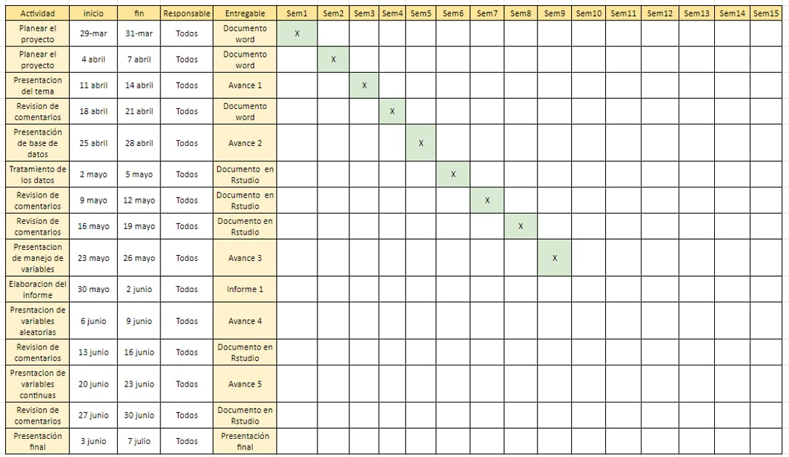

# Introducción

## Relevancia

La relevancia de nuestro proyecto radica que en la actualidad los servicios de Airbnb, representan una considerable oferta de alojamientos alrededor del mundo. Esta plataforma digital representa una gran acogida por muchos usuarios que desean alquilar un espacio a viajeros que buscan alojamiento, esto por la flexibilidad de precios en comparación con los hoteles.Es por ello que es importante realizar un análisis de en determinadas ciudades para conocer cómo funcionan los servicios de alojamiento en la actualidad.

## Objetivos

-   Analizar las ciudades con mejor ranking (ELABORAMOS NUESTRO PROPIO RANKING)de experiencia de Airbnb en Europa del 2023.

-   Describir las características de los alojamientos más caros y más económicos en ciudades de Europa del 2023.

-   Analizar la atracción de un Airbnb y su relación con su ubicación en ciudades de Europa del 2023.

## Planificación

En esta sección el equipo se presenta la planificación de todas la entregas hasta la semana 16 

# Datos

## Proceso de recolección de datos

Para el proceso de recolección se realiza una búsqueda de base de datos de la siguiente página web <https://www.kaggle.com/datasets/dipeshkhemani/airbnb-cleaned-europe-dataset?group=bookmarked>. La elegida, es una fuente secundaria que tiene un total de 41714 observaciones y un total de 19 variables.

-   Población

    La población del estudio son todos airbnb's de nueve ciudades principales en Europa en el 2023.

-   Unidad muestra

    La unidad muestra es cada airbnb (alojamiento) que se encuentra en funcionamiento en esas nueve ciudades en Europa. \## Muestreo El método de muestreo utilizado fue muestreo aleatorio simple.

-   Tamaño de la muestra

    El tamaño de la muestra son 41714 alojamientos.

## Variables

| N°  |          Variable           |         Tipo         | Restricciones                                                                                                     |
|:---:|:---------------------------:|:--------------------:|-------------------------------------------------------------------------------------------------------------------|
|  1  |            City             | (Categórica nominal) | Debe ser una de las nueve ciudades (Amsterdam, Roma, Lisboa , Viena, Atenas, París, Barcelona, Berlín y Budapest) |
|  2  |     Cuándo lo reservan      | (Categórica nominal) | Debe ser weekday o weekend.                                                                                       |
|  3  |          Room Type          | (Categórica nominal) | Debe ser una de los dos tipos de alojamiento "Entire home/apartamento" o "Cuarto privado"                         |
|  4  |         Shared Room         | (Categórica nominal) | Debe ser "Sí" o "No"                                                                                              |
|  5  |        Private Room         | (Categórica nominal) | Debe ser "Sí" o "No"                                                                                              |
|  6  |          Superhost          | (Categórica nominal) | Debe ser "Sí" o "No"                                                                                              |
|  7  |       Multiple Rooms        | (Categórica nominal) | Debe ser "Sí" o "No"                                                                                              |
|  8  |     Cleanliness Rating      | (Categórica ordinal) | Debe ser un número entero no negativo entre 0 y 10.                                                               |
|  9  |     Guest Satisfaction      | (Categórica ordinal) | Debe ser un número entero no negativo entre 0 y 100.                                                              |
| 10  |     Business (ofertas)      | (Categórica nominal) | Debe ser "Sí" o "No"                                                                                              |
| 11  |       Person Capacity       | (Numérica discreta)  | Debe ser un número entero no negativo.                                                                            |
| 12  |            Price            | (Numérica continua)  | Debe ser un número decimal no negativo en dólares.                                                                |
| 13  |          Bedrooms           | (Numérica discreta)  | Debe ser un número entero no negativo.                                                                            |
| 14  |      City Center (km)       | (Numérica continua)  | Debe ser un número decimal no negativo en kilómetros.                                                             |
| 15  |     Metro Distance (km)     | (Numérica continua)  | Debe ser un número decimal no negativo en kilómetros.                                                             |
| 16  | Normalised attraction Index | (Numérica continua)  | Debe ser un número decimal no negativo.                                                                           |
| 17  | Normalised restaurant index | (Numérica continua)  | Debe ser un número decimal no negativo.                                                                           |

## Limpieza de datos

#### Verificar Variables booleanas

-   **Multiple Rooms, Shared Room, Private Room y Oferta :** En primer lugar, se observa que Multiple rooms tiene como valor mínimo 0 y como valor máximo 1; esto mismo ocurre en el caso de la variable Oferta. Procedemos a analizar qué valores se encuentran dentro de estas dos variables.

    ```{r}
    par(mfrow=c(1,2))

    counts <- table(D2$`Multiple Rooms`)
    barplot(counts, main = "Multiple Rooms", ylab = "Número de Observaciones", xlab = "Valores" , ylim = c(0,35000))
    ```

# Análisis Descriptivo
